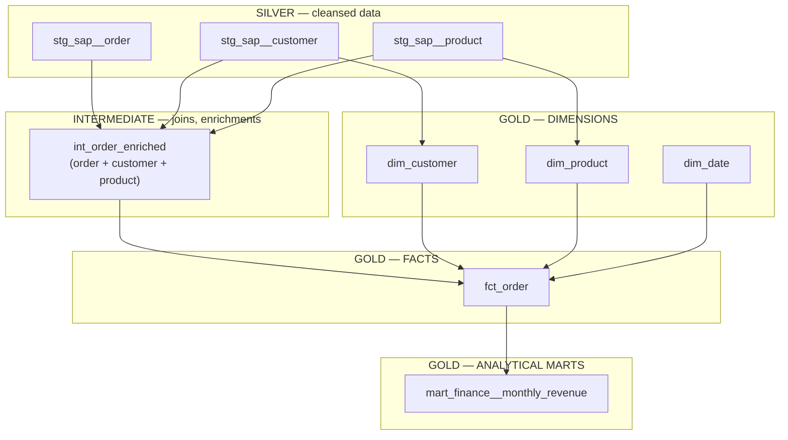

# Data layers

Two different axes describe a dbt model, and conflating them is the most
common source of confusion for anyone new to this project: the **medallion
architecture** describes *how refined and how durable* the data is, while the
**dbt model layers** describe *what kind of SQL transformation* produced it.
A model has exactly one position on each axis.

## The two axes

--8<-- "docs/assets/diagrams/data-layers.svg"

Bronze is not a dbt model at all — it's the ingestion pipeline's raw output,
read-only for dbt. Silver corresponds to `stg_` models. Intermediate (`int_`)
models sit *inside* Silver conceptually (further cleansing/joining) but are
not persisted to ADLS at all — see below. Gold corresponds to `dim_`, `fct_`,
and `mart_` models. This mapping, and exactly where each layer is physically
stored, is decided in
[ADR 0001](https://github.com/picot-data/data-platform-standards/blob/main/adr/0001-medallion-dbt-layer-persistence.md).

## The dbt layers, in transformation order

| Layer | What it does | What it must never do |
|---|---|---|
| **Staging** (`stg_`) | One-to-one with a source object: renaming, retyping, light cleansing | No joins, no aggregation. A `stg_` model that needs a join is an `int_` model |
| **Intermediate** (`int_`) | Joins and enrichments that don't yet belong to a specific dimension or fact | Producing something ready for a BI tool — that's Gold's job |
| **Dimensions** (`dim_`) | Descriptive attributes of a business entity (customer, product, date) | Holding measures or business-process facts |
| **Facts** (`fct_`) | Measurable events of a business process (an order, a delivery) | Duplicating dimension attributes instead of referencing them by key |
| **Marts** (`mart_`) | Pre-aggregated, domain-specific views for a recurring or complex analysis | Being the source of truth — dimensions and facts are; marts are a commodity built on top of them |

## Why a star schema, not marts built directly from staging

Building `mart_monthly_revenue` directly from staging models (skipping
dimensions and facts) works for a single question, but every *new* question
then means a new mart built from scratch, with its own copy of the same join
logic:

| Direct marts from staging | Star schema (dimensions + facts) |
|---|---|
| Each new question = a new mart from scratch | Each new question = a mart that joins the same dimensions/facts |
| "Sales by product category" → new model, new logic | "Sales by product category" → `SELECT` on `fct_order JOIN dim_product` |
| No self-service — everything is pre-aggregated | BI users can freely explore dimensions and facts |
| Adding a dimension means rewriting every mart | Adding a dimension means one new `dim_` table plus one key in the fact table |

Marts do not disappear in a star schema — they become the pre-aggregated
layer for recurring or complex analyses (e.g. a monthly finance dashboard, or
a cross-source analysis combining Gold data with an external source). The
rule that follows from this: **dimensions and facts are the source of truth;
marts are commodities** built on top of them, never the other way around.

## Multi-entity tables

Every fact and dimension table carries an `entity` column (`'D'`, `'B'`,
etc.) rather than one table per entity. When a new entity's data lands in
`fct_order`, it arrives as additional rows with a new `entity` value in the
same table — a group-level dashboard filters on
`entity IN ('D', 'B')`, an entity-level dashboard filters on `entity = 'D'`.
Same table, same structure, no duplication. See
[Naming conventions](naming-conventions.md#technical-metadata-columns) for the
column definition, and
[Azure landing zones](azure-landing-zones.md#resource-naming-pattern) for how
this `entity` code maps to the separate infrastructure `scope` code used in
Azure resource names.
