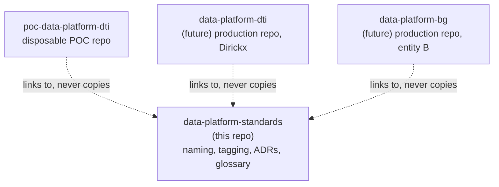

# Repositories and delivery

## Repository topology



`data-platform-standards` holds group-wide rules and decisions only — no
entity-specific code or data. Every entity repository implements these rules
and links back to this site rather than duplicating any of it. This is a
deliberate constraint: the first time a naming rule is copy-pasted into an
entity repo instead of linked, it starts drifting the moment either copy is
edited.

## Why one repo per entity, not one mega mono-repo for the whole group

Within a single entity, ingestion, transformation, orchestration, and
infrastructure code live together in **one mono-repo** — not split into
separate repos per component. A schema change in ingestion impacts dbt
models; in a mono-repo that's one commit, in a split-repo setup it's a dance
of synchronized pull requests across repositories. Splitting by *component*
only pays off once multiple contributors need independent release cadences
per component, which a single-owner Level 1 platform does not have.

Across entities, the boundary is different: each entity gets its **own**
mono-repo (`poc-data-platform-dti` today, a future `data-platform-<code>` in
production), rather than one repository shared by every entity. This follows
the same reasoning as one VM per entity
([ADR 0006](https://github.com/picot-data/data-platform-standards/blob/main/adr/0006-single-vm-for-level-1.md)):
each entity has its own Azure subscription, its own access boundary, and
potentially its own contributors — a shared repository would force shared
write access across entities that don't need it.

## Entity mono-repo structure

```text
data-platform-<entity>/
├── ingestion/
│   ├── sap/
│   └── common/
├── transformation/          ← the dbt project
│   ├── models/
│   │   ├── staging/
│   │   ├── intermediate/
│   │   ├── dimensions/
│   │   ├── facts/
│   │   └── marts/
│   ├── seeds/
│   ├── macros/
│   ├── tests/
│   └── metrics/             ← MetricFlow definitions
├── orchestration/
│   └── dagster_project/
├── infra/
│   ├── terraform/
│   └── scripts/
│       └── bootstrap_vm.sh
├── docs/
│   └── runbook.md           ← operational procedures specific to this entity
├── pyproject.toml
└── uv.lock
```

Governance documentation (naming, tagging, landing zones, data layers,
semantic layer) is **not** duplicated here — it lives in
[data-platform-standards](index.md) and is linked from this repo's `README.md`.

## Branching

| Type | Pattern | Example |
|---|---|---|
| Main branch | `main` | — |
| Feature | `feature/<domain>/<short-desc>` | `feature/ingestion/sap-sales-connector` |
| Bugfix | `fix/<short-desc>` | `fix/stg-order-duplicates` |

Short-lived feature branches merged into `main` are enough for a
single-contributor platform — there is no long-lived `develop` branch to
maintain as a separate integration point.

## Commits

Pattern: `<type>(<scope>): <description>`, following
[Conventional Commits](https://www.conventionalcommits.org/). Types: `feat`,
`fix`, `docs`, `refactor`, `test`, `chore`, `ci`.

## Minimal CI/CD

Every entity repository runs, at minimum, a `ci.yml` workflow on every push
and pull request:

1. **Lint** the code (Python, SQL/dbt style).
2. **`dbt parse`** — catches syntax and reference errors without touching any
   data. This answers "does it compile?", not "does it work?".
3. **`dbt build --target dev`** (or dbt unit tests) — runs the models and
   their tests against dev data. This answers "does it work on data?".

A `deploy.yml` workflow, deploying merged code to the entity's VM, is
optional for a single-owner platform and must be explicitly documented as
*not implemented* rather than left ambiguous if it isn't built — a manual
deployment procedure written down in the entity's `runbook.md` is preferable
to a half-working deploy pipeline that looks automated but silently isn't.

This CI/CD discipline is what answers the question a steering committee will
ask sooner or later: *"how do we know this isn't hand-patched on the VM?"* —
the answer is that code is tested before it is deployed, not modified
directly on the machine that runs it.

## This standards repository's own delivery

`data-platform-standards` builds and publishes its own site via
`.github/workflows/docs.yml`: every push to `main` builds the MkDocs site and
deploys it to GitHub Pages. There is no separate dev/staging step for
documentation — a broken build fails the workflow and nothing gets
published, which is enough gatekeeping for a documentation site.
